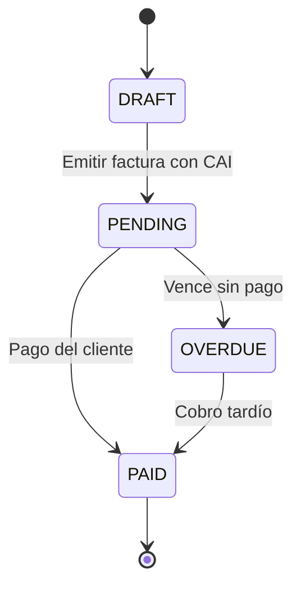
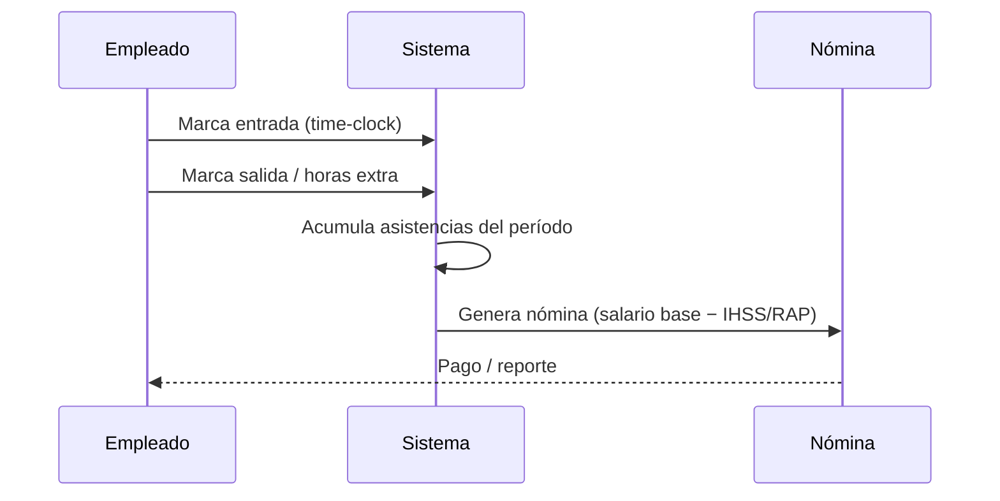
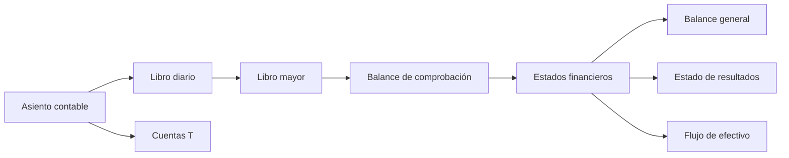
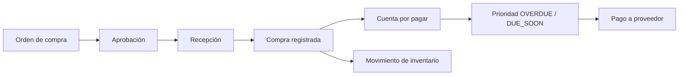
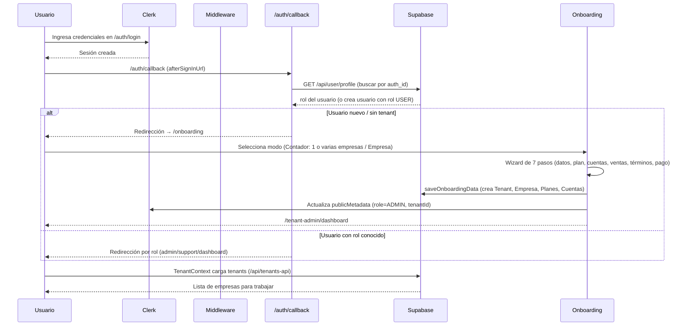
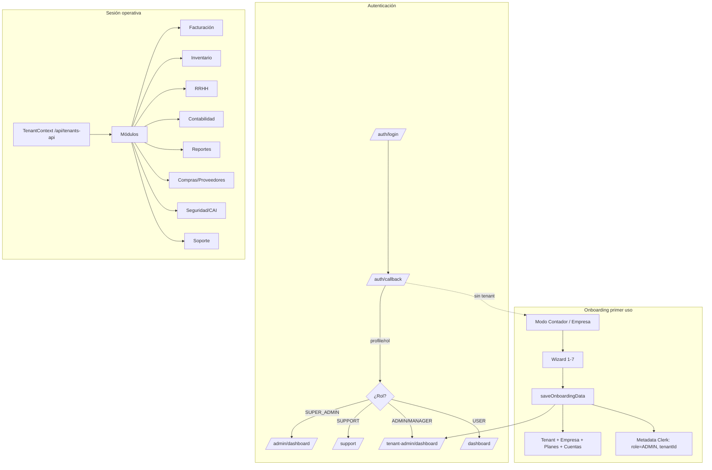
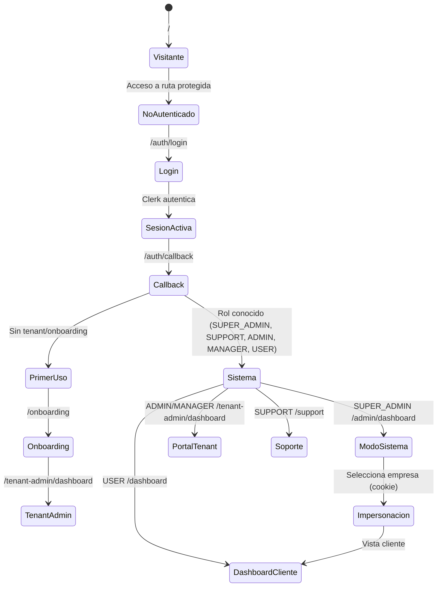
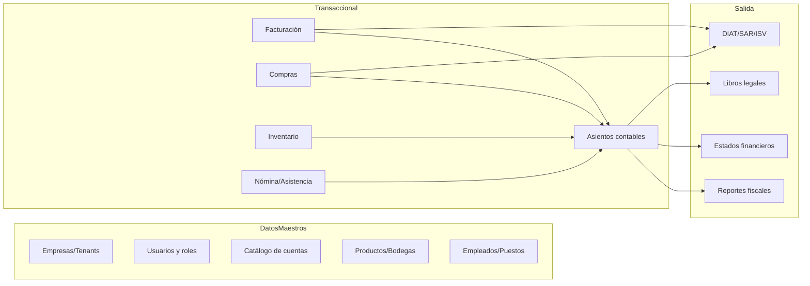

# Workflow Completo: Inicio de Sesión → Onboarding → Uso del Sistema

> Documento que describe el flujo completo de **Diamond Accounting (Contab)** desde el acceso a la plataforma, pasando por el registro/inicio de sesión, el onboarding de primer uso y el uso de los módulos internos.

---

## 1. Vista General del Flujo

```
┌─────────────────┐     ┌──────────────┐     ┌──────────────────────┐
│  /  (raíz)      │────▶│ /auth/login  │────▶│ Login con Clerk      │
└─────────────────┘     └──────────────┘     │ (email / social / MFA)│
                                             └──────────┬───────────┘
                                                        ▼
                                             ┌──────────────────────┐
                                             │ /auth/callback       │
                                             │ (verifica rol en DB) │
                                             └──────────┬───────────┘
                                                        ▼
                          ┌─────────────────────────────┴─────────────────────────────┐
                          ▼                                                            ▼
            ¿Tiene tenant/onboarding?                          Usuario ya configurado (tiene rol)
          NO → /onboarding (primer uso)                               │
                          │                                          ▼
                          ▼                              ┌──────────────────────────────┐
          ┌────────────────────────────┐                │  SUPER_ADMIN → /admin/dashboard│
          │ Modo: Contador / Empresa   │                │  SUPPORT     → /support        │
          │ Wizard 7 pasos             │                │  ADMIN/MANAGER→ /tenant-admin/ │
          │ (Datos→Plan→Catálogo→Logo  │                │  USER         → /dashboard      │
          │ →Ventas→Términos→Pago)     │                └──────────────────────────────┘
          └────────────┬───────────────┘
                       ▼
          Crea Tenant + Empresa + Planes + Cuentas (Supabase)
          Actualiza metadata de rol/tenant en Clerk
                       │
                       ▼
          FIN → /tenant-admin/dashboard (o Stripe Checkout si aplica)
```

---

## 2. Rutas Públicas y Middleware

Archivo clave: `middleware.ts`

### Rutas públicas (no requieren sesión)
- `/` (raíz)
- `/auth/login`, `/auth/register`, `/auth/sign-in`, `/auth/sign-up`
- `/auth/callback`
- `/auth/reset-password`
- `/api/auth/check-email`, `/api/auth/check-username`
- `/api/admin/plans-public`
- `/api/paypal/*`, `/api/webhooks/*`
- `/api/accounting/uploaded-files`, `/api/accounting/excel-upload` (`/api/accounting/trial-balance` salió el 17 Sept 2026)

### Comportamiento del middleware
1. Si la ruta **no es pública**, exige autenticación con `auth.protect()`.
2. Si es una ruta de **admin** (`/admin`, `/api/admin`), valida que el rol del usuario esté entre `SUPER_ADMIN`, `SUPPORT`, `ADMIN`, `MANAGER`. Si no, redirige a `/dashboard`.
3. Si un `SUPER_ADMIN` entra a `/dashboard`, se le redirige a `/admin/dashboard` (modo sistema).
4. Inyecta el header `x-tenant-id` con el `tenantId` del metadata de Clerk, **solo si** la petición no trae ya un tenant explícito (así `/companies/{companyId}/...` no se pisa con el metadata).
5. Un usuario es tratado como super admin si su rol es `SUPER_ADMIN` **o** su correo es `sucachi.123@gmail.com`.

---

## 3. Inicio de Sesión (Login)

Archivo clave: `app/auth/login/page.tsx`

### 3.1 Pantalla
- Componente `<SignIn>` de Clerk estilizado (Diamond Accounting).
- Permite: correo + contraseña, proveedores sociales (si están activos), y demás métodos de Clerk.
- Link a registro: `/auth/register`.
- `afterSignInUrl` global configurado en `app/layout.tsx` → `/auth/callback`.

### 3.2 Redirección tras iniciar sesión (callback)
`app/auth/callback/page.tsx`:

1. Espera a que Clerk cargue el usuario (`useUser()`).
2. Consulta `GET /api/user/profile`:
   - Busca al usuario en la tabla `users` (Supabase) por `auth_id`.
   - **Si no existe**, lo crea automáticamente con rol `USER`, `role: USER`, `is_active: true`, timezone `America/Tegucigalpa`.
3. Según el rol recuperado de la base de datos, redirige:
   - `SUPER_ADMIN` (o email `sucachi.123@gmail.com`) → `/admin/dashboard`
   - `SUPPORT` → `/support`
   - `ADMIN` / `MANAGER` → `/tenant-admin/dashboard`
   - Cualquier otro → `/dashboard`
4. Si la API falla, cae a `/dashboard` como respaldo.

### 3.3 Verificación alternativa de estado (API)
`app/api/tenant/check-user-tenant/route.ts` devuelve si el usuario necesita onboarding:

| estado | condición |
|---|---|
| `needs_tenant` | El usuario no tiene `tenantid` en la tabla `User` → `/onboarding` |
| `needs_onboarding` | Existe pero `onboarding_companies.setup_completed` es falso → `/onboarding` |
| `needs_company_setup` | Tiene tenant pero no tiene `companies` → `/onboarding` |
| `configured` | Tiene tenant, onboarding completado y empresa → `/dashboard` |

---

## 4. Registro (Sign Up)

Archivo clave: `app/auth/register/page.tsx`

### 4.1 Formulario
- **Campos**: Nombre, Apellido, Usuario, Email, Contraseña, Confirmar contraseña.
- **Validaciones**:
  - Usuario mínimo 3 caracteres, solo `a-zA-Z0-9_`.
  - Disponibilidad de usuario en tiempo real → `GET /api/auth/check-username` (con sugerencias).
  - Email válido y no duplicado → `GET /api/auth/check-email`.
  - Contraseña: mínimo 8 caracteres, 1 mayúscula, 1 símbolo. Indicador de fortaleza visual.
- **Paso 2 (verificación)**: se envía un código por correo (Clerk) y el usuario debe ingresarlo (`signUp.verifications.verifyEmailCode`).

### 4.2 Redirección post-registro
- `redirect_url` por query param; por defecto → **`/onboarding`**.
- Usa `useSignUp` → `signUp.create` → `signUp.password` → verificación por email → al completo redirige a `/onboarding`.

---

## 5. Onboarding (Primer uso)

Archivo clave: `app/onboarding/page.tsx`
Acción de guardado: `lib/actions/onboarding.ts` (`saveOnboardingData`)

### 5.1 Paso 0 — Selección de modo
- **Soy Contador** (`accountant`): administra una o varias empresas.
  - Al seleccionarlo, **se pregunta si llevará la contabilidad de 1 sola empresa o de varias**, con dos tarjetas: *Solo 1 empresa* / *Varias empresas*. Al elegir se omite la confirmación y se pasa directamente al Paso 1 del wizard (`business-setup`). La elección se guarda en `localStorage` como `accountantCompanies`.
- **Tengo una Empresa / Negocio** (`business`): entra directamente al wizard de 7 pasos (Paso 1: datos de la empresa).

### 5.2 Eliminado — Paso 0.5 Tipo de negocio
~~Clínica dental, consultorio médico, farmacia, tienda/comercio, servicios profesionales, manufactura/producción, otro negocio.~~ (paso eliminado del onboarding)

### 5.3 Wizard

| # | Paso | Contenido |
|---|---|---|
| 1 | **Datos Empresa** | Nombre de empresa*, RTN* (máscara `xxxx-xxxx-xxxxxx` + chequeo de unicidad), **rubro/giro*** (select `industry`), dirección exacta, **departamento*** (select), **municipio*** (select dependiente del departamento, dataset HN `lib/data/honduras-locations.ts`), país (por defecto Honduras), email, teléfono cliente, teléfono empresa. Además: **¿Quién lleva la contabilidad?** (Yo la llevo / Tengo contador). Si "Tengo contador" se **omite** el paso de Catálogo de Cuentas. **En modo contador con *varias empresas*** el paso muestra una lista con pestañas por empresa y un botón **Agregar Empresa** (cada empresa se valida y guarda por separado en `companies[]`; la primera queda como principal). |
| 2 | **Catálogo de Cuentas** (opcional) | Cuentas por defecto (activos, pasivos, patrimonio, ingresos, gastos) con selección individual o "Seleccionar todas / Deseleccionar todas". Solo visible si el usuario lleva su contabilidad. **En modo contador con *varias empresas*** el catálogo se selecciona **por empresa** (pestañas por compañía; cada una guarda su propia selección, ya que las contabilidades son separadas y pueden diferir). |
| 3 | **Imagen** | Subir logo de la empresa (opcional, JPG/PNG/SVG máx 2MB). Subida **real a Supabase Storage** (bucket `company-logos`) vía `POST /api/onboarding/logo-upload` con `XMLHttpRequest` y **barra de progreso**. El bucket es **privado**: se devuelve una signed URL para previsualizar y el **path** para persistir. **En modo contador con *varias empresas*** el logo se sube **por empresa** (pestañas por compañía; el path se guarda en el `logo_url` de cada `companies`). Al finalizar, cada logo se mueve de `onboarding/{userId}/…` a `{tenantId}/…` y el de la empresa principal también se guarda en `Tenant.logo_url`. |
| 4 | **Config. Ventas** | Habilitar CAI (facturación electrónica SAR), tipo de CAI (Auto-impresión / Imprenta), **código CAI con máscara `XXXXXX-XXXXXX-XXXXXX-XXXXXX-XXXXXX-XX` (6-6-6-6-6-2)**, **fecha de vencimiento del CAI**, **rango inicial/final del punto de emisión con máscara `000-001-01-00000001` (3-3-2-8)**, tasas de impuesto configurables (ISV, IT, IVA, ISR, Exento, Otro — se pueden agregar varias), prefijo de factura (ej. `001-001-`). **En modo contador con *varias empresas*** se configura **por empresa** (pestañas por compañía): cada una guarda su propio CAI/impuestos/prefijo en `sales_configuration.company_id`. Los impuestos se consolidan a nivel tenant (tabla `Taxes`) sin duplicar tipo+tasa. |
| 5 | **Términos** | Texto de Términos y Condiciones (lectura) + checkbox obligatorio de aceptación. Link a `/terms`. |
| 6 | **Seleccionar Plan** | Lista de planes desde `GET /api/admin/plans-public`. Multi-selección. Muestra resumen: subtotal, ISV 15%, total mensual en HNL. (Es obligatorio elegir al menos 1). |
| 7 | **Método de Pago** | Tarjeta, PayPal, Google Pay, Stripe con modales de captura de datos. Muestra resumen mensual. |

### 5.4 Botones de navegación del wizard
- **Anterior / Volver** según el paso.
- **Siguiente**: deshabilitado si falta seleccionar contador (paso 1), el **RTN no es válido** (paso 1), elegir plan (paso 6) o aceptar términos (paso 5).
- Al final: **"Saltar y Finalizar"** o **"Finalizar Configuración"**.

**RTN hondureño:** el campo se **formatea automáticamente** como `xxxx-xxxx-xxxxxx` (4-4-6, 14 dígitos, función `maskRTN`). Mientras no esté completo (menos de 14 dígitos) muestra el error "El RTN debe tener 14 dígitos válidos"; al completar los 14 dígitos consulta `GET /api/onboarding/check-rtn?rtn=...` (debounce 400 ms) y muestra: **check verde** si es único, spinner mientras verifica, o error "Este RTN ya está registrado por otra empresa" si existe otro registro con ese RTN (búsqueda en `companies` con guiones o sin guiones). "Siguiente" del paso 1 se habilita solo con 14 dígitos completos y RTN único en todas las empresas (modo contador multi-empresa).

### 5.5 Qué hace `saveOnboardingData` (acción de servidor)
1. Verifica sesión (`auth()`). Sin sesión → error.
2. Obtiene email/nombre del usuario desde Clerk (`currentUser` / `sessionClaims`).
3. Busca al usuario en la tabla `User` por `authid`:
   - **Si no existe**: crea un **Tenant** nuevo (`Tenant`) con código generado a partir del nombre del negocio (6 letras + 2 aleatorios, ej. `EMPRESABC`), plan `BASIC` por defecto, `max_users: 5`, `modules: 'ACCOUNTING,BILLING,REPORTS'`. Después crea el usuario `User` ligado al tenant con rol **dinámico**: `ADMIN` en modo empresa, `ACCOUNTANT` en modo contador.
   - **Si ya existe**: crea un nuevo tenant y actualiza el `tenantid` del usuario.
4. Actualiza **metadata de Clerk** (`publicMetadata`):
   ```json
   {
     "role": "<ACCOUNTANT | ADMIN>",
     "tenantId": "<id>",
     "tenantCode": "<id>",
     "permissions": ["accountant", "tenant_admin"] | ["admin", "tenant_admin"],
     "paymentMethod": "card",
     "hasAccountant": false,
     "isolation": { "tenantId": "<id>", "mode": "strict" }
   }
   ```
   y `privateMetadata`: `{ "onboardingCompleted": true, "companyId": "<uuid>", "hasAccountant": false }`.
5. Crea la(s) **empresa(s)** (`companies`) asociada(s) al tenant, con columnas `logo_url`, `department`, `municipality` (y el resto de datos del paso 1). **Loop por empresas**: usa `data.companies ?? [data.companyData]` — en modo contador con varias crea todas las del array y la primera queda como principal. Si hay logo, **mueve el archivo** de la carpeta temporal `onboarding/{userId}/` a la carpeta del tenant `{tenantId}/` y guarda el **path** final en `logo_url`. El logo es **por empresa** (`companies[i].logoUrl`); el de la primera empresa también se guarda en `Tenant.logo_url`.
6. Guarda **cuentas bancarias** (`company_bank_accounts`).
7. Guarda **configuración de ventas por empresa** (`sales_configuration`: `cai_enabled`, `cai_type`, `cai_code`, `cai_range_start`/`cai_range_end` del rango del punto de emisión, `cai_expiry_date` en formato `YYYY-MM-DD`, `tax_rate`, `invoice_prefix`). Usa `salesConfigs[índice]` alineado con `companies`; los impuestos se consolidan a nivel tenant en `Taxes` sin duplicar tipo+tasa.
8. Guarda los **planes seleccionados** (`tenant_plans`).
9. Guarda referencia en `onboarding_companies` (`setup_completed: true`).
10. Crea **catálogo de cuentas por empresa** (`chart_of_accounts`): activos, pasivos, patrimonio, ingresos, gastos. Usa la selección individual de cada empresa (`selectedAccountsList[índice]` alineado con `companies`; respeta el catálogo default si no viene).

> Nota: si algo falla, el onboarding **no bloquea**; el flujo continúa al dashboard (los datos se guardan también en `localStorage` como respaldo).

### 5.5.1 Almacenamiento del logo (aislado por tenant)
- Bucket `company-logos` es **privado** (`public = false`), 5 MB máximo, MIME permitidos: `image/jpeg`, `image/png`, `image/gif`, `image/webp`, `image/svg+xml`.
- Cada archivo vive en una carpeta identificada por el tenant: `{tenantId}/logo-{timestamp}.{ext}`. En modo contador con varias empresas hay **un logo por empresa** (cada uno con su propio `logo-{timestamp}.{ext}`).
- Durante el onboarding (aún no existe el tenant) cada logo se sube a una carpeta temporal `onboarding/{userId}/logo-{timestamp}.{ext}` y `saveOnboardingData` los mueve a `{tenantId}/...` al crear el tenant (uno por cada empresa).
- Las políticas RLS aíslan por carpeta: `split_part(name, '/', 1) = auth.jwt() ->> 'tenantId'` para insert/select/update/delete.
- `logo_url` en BD guarda el **path** de storage, no una URL. Para mostrar se genera una **signed URL** temporal (1 hora) vía `createSignedUrl` en las rutas `/api/onboarding/logo-upload`, `/api/billing/logo-upload`, `/api/billing/logo` y `/api/billing/logo-get`.
- Los uploads del onboarding usan **service-role** (bypass RLS) porque aún no hay sesión Supabase/tenant; los de billing también pasan por servidor.
- Para crear/configurar el bucket: `supabase/create-supabase-bucket.sql` (ejecutar en Supabase SQL Editor).
- Columnas necesarias en `companies`: `logo_url`, `department`, `municipality` → migración `scripts/migrations/009_ADD_COMPANIES_LOGO_DEPARTMENT_MUNICIPALITY.sql`.

### 5.6 Redirección final del onboarding
```js
router.push('/tenant-admin/dashboard');
```
- **Ambos modos (contador y empresa)** redirigen a `/tenant-admin/dashboard` (antes contador iba a `/dashboard`).
- El nuevo dueño es `ADMIN` de su propio tenant, por eso es llevado a su panel administrativo (`/tenant-admin/dashboard`).
- **Excepción Stripe**: si el método de pago fue `stripe` y hay planes seleccionados, primero redirige a `/api/stripe/checkout` (crea sesión de pago con `planPrice`, `customerEmail`, `tenantId`). Tras el checkout, el usuario vuelve por `/payment/success` o `/payment/cancel`.

### 5.7 Selector de empresa (modo contador multi-empresa)
- En el header (`components/dashboard/TenantHeader.tsx`) aparece un **dropdown nativo** (`<select>`) cuando el tenant tiene >1 empresa (`companies.length > 1`).
- Muestra el **nombre de la empresa seleccionada** en el título del header + RTN.
- Al cambiar: `setCompany(c)` actualiza `currentCompany` en `TenantContext` + `localStorage.selected_company` + `tenant_id`.
- El dashboard (`/tenant-admin/dashboard`) lee `currentCompany` y pasa `companyId` a la API (`/api/tenant-admin/dashboard?companyId=...`).
- Todas las métricas (KPIs, AR aging, cash flow, top clients, tax alerts) se filtran por `company_id` en la BD — **datos de distintas empresas nunca se cruzan**.

### 5.8 Migración `company_id` en tablas multi-tenant
Para aislar datos por empresa dentro del mismo tenant, se añadió columna `company_id` (FK a `companies.id`) + índice a 11 tablas:
- `Invoice`, `Transaction`, `JournalEntry`, `Account`, `InvoiceItem`, `InvoicePayment`, `InvoiceNote`, `product`, `User`, `BankAccount` (y `sales_configuration` ya lo tenía).
- Backfill automático usando la relación `tenant_id` → `companies.tenant_id` (subqueries correlacionadas para tablas hijas `InvoiceItem/Payment/Note`).
- Migración: `scripts/migrations/012_ADD_COMPANY_ID_TO_MULTI_TENANT_TABLES.sql` (ejecutar en Supabase SQL Editor por bloques para evitar deadlocks).
- Verificación: `total = con_company_id` en todas las tablas tras el backfill.

### 5.9 Fixes de contexto y dashboard multi-empresa (17 sep 2026)

| # | Fix | Archivo | Descripción |
|---|---|---|---|
| F1 | Eliminar `TenantProvider` anidado | `app/tenant-admin/layout.tsx` | El layout tenía su propio `TenantProvider` anidado que creaba contexto separado; el header (root) cambiaba empresa pero el dashboard usaba el contexto anidado (desactualizado). **Fix:** quitar `TenantProvider` anidado y usar solo el root. |
| F2 | Restaurar header en `/tenant-admin` | `app/tenant-admin/layout.tsx` | Al quitar el provider anidado se perdió el header. **Fix:** volver a poner `<TenantHeader />` sin el provider anidado. |
| F3 | Debug API dashboard | `app/api/tenant-admin/dashboard/route.ts` | Añadidos logs de debug para verificar filtrado por `company_id` (subqueries correlacionadas en helper `withCompany`). |
| F4 | Fix middleware impersonación | `middleware.ts:51-56` | Omite redirect de SUPER_ADMIN en `/dashboard` si existe cookie `impersonated_tenant_id`. |
| F5 | Fix middleware planes públicos | `middleware.ts:41` | Añade `!isPublicRoute(req)` para que `/api/admin/plans-public` no sea bloqueado por check de admin. |

---

## 6. Después del Onboarding (uso normal)

### 6.1 Selección de Tenant (Contexto)
Archivo clave: `lib/contexts/TenantContext.tsx`

- Al cargar, consulta `GET /api/tenants-api` y carga la lista de tenants con datos enriquecidos (empresa, módulos activos).
- Guarda el tenant actual en `localStorage` (`selected_tenant`, `tenant_id`).
- **Modo sistema / Impersonación (Super Admin)**:
  - El super admin entra por defecto en "modo sistema" (`currentTenant = null`, panel admin).
  - Al seleccionar una empresa se setea la cookie `impersonated_tenant_id` (30 min) y se ve la app como cliente → `setTenant()` navega a `/dashboard`.
  - `exitImpersonation()` limpia cookie y localStorage y vuelve a `/admin/tenants`.

### 6.2 Landing por rol (resumen)

| Rol | Destino | Módulos principales en el sidebar |
|---|---|---|
| SUPER_ADMIN | `/admin/dashboard` | Dashboard, Panel Admin, Usuarios, Tenants, Sistema, Reportes Globales, Planes, Facturas (todas), Tickets, Chat |
| ADMIN | `/tenant-admin/dashboard` | Panel Admin, Usuarios, Inventario, Facturación, Módulos, Configuración, RRHH, Asistencia |
| MANAGER | `/tenant-admin/dashboard` | Panel Gerencia, Usuarios, Inventario, Facturación, Módulos, Soporte |
| SUPPORT | `/support` | Dashboard, Panel Soporte, Ver Usuarios, Ver Tenants, Logs, Reportes, Tickets |
| ACCOUNTANT | `/dashboard` (o vista contador) | Mi Empresa, Contabilidad (Catálogo), Facturación, Reportes, Soporte, RRHH, Asistencia |
| USER / VIEWER | `/dashboard` | Mi Empresa, Contabilidad, Facturación, RRHH, Asistencia |

### 6.3 Guard: plan de prueba (TrialGate)
Archivo clave: `components/trial-gate.tsx`
- Si el tenant tiene plan `BASIC`, funciones avanzadas se muestran bloqueadas con overlay y botón **"Actualizar mi Plan"** → `/billing/subscriptions`.

### 6.4 Layout
- `LayoutWrapper` decide si mostrar header + sidebar según la ruta:
  - Sin layout: `/auth/*`, `/onboarding`, `/support`, `/admin`, `/dashboard`, `/tenant-admin`, `/accountant`.
  - Con layout (header + `RoleBasedSidebar`): el resto de rutas de negocio (ej. `/companies/...`, `/billing`, `/inventory`, `/hr`, ...).

---

## 7. Módulos principales (después de ingresar)

Una vez terminado el flujo de sesión/onboarding, el usuario trabaja con las áreas operativas. Detalle por módulo:

### 7.1 Facturación (Billing)

**Rutas**: `/billing`, `/billing/{id}`, `/billing/invoices`, `/billing/pos`, `/billing/notes`, `/billing/expenses`, `/billing/cai`, `/billing/payment-links`, `/billing/subscriptions`, `/billing/generate-invoice`, `/account/billing`

- **Facturas**: listado y detalle con formato legal hondureño pre-maquetado (RTN, CAI, impuestos). Estados: `PAID`, `PENDING`, `OVERDUE`, `ACTIVE`. Incluye vista previa legal, versión "Disney", plantillas e imagen de factura.
- **POS**: punto de venta con generador de links de pago e información de CAI.
- **Notas**: notas de crédito y débito con CRUD propio (`/api/billing/notes`).
- **Gastos mensuales**: CRUD de gastos (proveedor, RTN, CAI, desglose de ISV) en `/billing/expenses`.
- **Links de pago**: se generan por factura (`/api/billing/payment-links`) y se cobran vía PayPal/Stripe (`/api/paypal/create-order|capture-order`, `/api/stripe/checkout`).
- **CAI / Talonarios**: manejo de rangos de autorización (`cai`, `talonarios`).
- APIs: `GET/POST/PUT /api/billing/invoices`, `GET/POST /api/billing/expenses`, `GET /api/tenant/my-tenant`.



### 7.2 Inventario

**Rutas**: `/inventory`, `/inventory/kardex`, `/companies/{id}/inventory/{page,kardex}`

- **Productos y bodegas**: CRUD directo sobre Supabase (`product`, `warehouse`) con helpers `selectWithTenant` / `insertWithTenant` / `updateWithTenant` / `deleteWithTenant`.
- **Movimientos de stock**: `inventory_movement` (entradas, salidas, transferencias).
- **Alertas de stock bajo**: campos `min_stock`, `reorder_point`.
- **Kardex**: historial de movimientos por producto/bodega.

### 7.3 Recursos Humanos (RRHH)

**Rutas**: `/companies/{id}/hr/{page,employees,payroll,attendance,attendance/reports,attendance/time-clock,departments,hierarchy,org-chart,pip,reports,vacations,vacations/calendar}`

- **Empleados**: alta/baja, departamento y puesto (`/api/companies/{id}/hr/positions`).
- **Nómina (payroll)**: generación con salario base y deducciones legales (IHSS/RAP).
- **Asistencia / Time-clock**: entrada/salida, horas extra y reportes de asistencia.
- **Departamentos y jerarquía**: CRUD de departamentos, jerarquía y organigrama.
- **Vacaciones**: gestión y calendario de vacaciones.
- **PIP**: evaluaciones de desempeño y métricas.
- Tablas: `employees`, `payroll`, `attendance`, `departments`, `positions`, `vacations`.



### 7.4 Contabilidad

**Rutas**: `/accounting`, `/accounting/{accounts,books,integrated-books,journal,reports,taxes}`, `/transactions`, `/closing`, `/companies/{id}/accounting/*`

- **Catálogo de cuentas**: `ChartOfAccountsManager` con plantillas PYME (37), Comercial (53) y Servicios (28). Tabla `chart_of_accounts`.
- **Asientos / voucher**: formulario debe/haber con autocompletado de cuentas (`/api/accounting/transactions`, `JournalEntryForm`, `TransactionFormSimple`).
- **Libros**: Diario, Mayor, Compras, Ventas, Balance + **libros integrados** (`/api/accounting/integrated-books?bookType=diario|mayor|balance`).
- **Estados financieros**: Balance de Comprobación, Balance General, Estado de Resultados, Flujo de Efectivo.
- **Saldos iniciales**: `/api/accounting/opening-balances`.
- **Cierre de período**: entrada de ajustes y cierre (`/api/closing/perform`, `PeriodLocks`).
- **Reversiones y partidas recurrentes**: `/api/accounting/reversals`, `/api/accounting/recurring-entries`.
- **Plantillas de asientos**: `/api/accounting/journal-templates`.
- **Impuestos/Retenciones**: tabla `Taxes` y `Retentions` (tipo IVA|ISR|ISV|OTRO).
- **Simplificada**: pestañas partida/libros + importación de Excel.



### 7.5 Reportes

**Rutas**: `/reports`, `/accounting/reports`, `/companies/{id}/business-reports`, `/companies/{id}/reports/purchase-book`

- Reportes fiscales hondureños: **balance general, estado de resultados, flujo de efectivo, libro diario, compras/ventas, resumen ISV, DIAT, balanza de comprobación, top clientes** (`/api/reports/*`).
- **Libro de compras**: filtro mes/año con `supplier_rtn`, `cai`, `net_value`, `tax_value`, `total_value`.
- **Business reports**: KPIs estilo inmobiliario (profitabilidad, ocupación, mantenimiento, marketing) en `/api/companies/{id}/reports/*`.

### 7.6 Seguridad / Fiscal (CAI, Retenciones, Legal)

**Rutas**: `/companies/{id}/security`, `/companies/{id}/security/(modules)/{cai,legal,retenciones,auditoria,panel-control,usuarios-restringidos,sar,digital,fisico,protocolos,respaldo,reporte,matrix,control}`

- **CAI**: gestión de códigos de autorización y rangos (tabla `cai`).
- **Retenciones / SAR**: declaraciones y configuración de retenciones.
- **Legal / Auditoría**: revisiones legales, acciones, alertas y métricas (procedures `LEGAL_REVISIONES_*`).
- **Panel de control / usuarios restringidos / respaldo / digital / físico**: matriz de seguridad y control documental.

### 7.7 Compras y Proveedores

**Rutas**: `/companies/{id}/purchases`, `/companies/{id}/purchases/dashboard`, `/companies/{id}/accounts-payable`, `/companies/{id}/purchase-orders`, `/companies/{id}/suppliers`

- **Compras**: CRUD con `invoice_number`, RTN, proveedor e ISV. Tabla `Purchase`.
- **Dashboard de compras**: totales por mes y ranking de proveedores (`/api/purchases/dashboard`).
- **Cuentas por pagar**: prioridad `OVERDUE | DUE_SOON | NORMAL` con `days_overdue`.
- **Órdenes de compra**: estados `DRAFT | PENDING | APPROVED | RECEIVED | COMPLETED | ...`.
- **Proveedores**: CRUD (tabla `Supplier`).



### 7.8 Portal del tenant (Tenant-admin)

**Rutas**: `/tenant-admin/{dashboard,summary,settings,users,users/create,users/{id}/edit}`

- Dashboard de KPIs, resumen y settings de la empresa.
- Gestión de usuarios del tenant (solo `ADMIN | MANAGER | SUPER_ADMIN`), generación de contraseña segura (12 caracteres), edición de nombre/email/rol.
- APIs: `GET /api/users`, `GET /api/tenant/my-tenant`, `GET /api/tenant-admin/dashboard`.

### 7.9 Panel Super Admin (Sistema)

**Rutas**: `/admin/{dashboard,panel,users,tenants,tenants/create,tenants/{id},plans,billing,billing/invoices,billing/generate-invoice,reports,system,activity,modules,settings,accounting,audit,chat,resolver,test}`

- CRUD de tenants y asignación de planes; CRUD de usuarios globales.
- Gestión de **planes** y límites (`@/lib/constants/modules`), con precios: BASICO 500, PREMIUM 1000, ENTERPRISE 2000, STARTER 200, GROWTH 750 (+15% ISV).
- Generación de factura de suscripción para tenants (`/api/admin/billing/invoices`).
- Estado del sistema, logs de actividad/auditoría, configuración y módulos.
- Chat de soporte + cola de resolución (`/api/admin/chat`, `/api/admin/resolver`).
- Páginas de debug para validar rol (`/admin/test`).

### 7.10 Soporte (Support)

**Rutas**: `/support/{dashboard,panel,tickets,audit,databases,reports,tenants,tenants/{id},users}`, `/dashboard/support/new`

- **Tickets**: creación, detalle, respuestas y adjuntos (`/api/support/tickets`, `/api/support/tickets/attachments`).
- **Búsqueda de tenants y usuarios**: `/api/support/tenants`, `/api/support/users`.
- **Reset de contraseña**: `POST /api/support/reset-password`.
- **Visor de esquema BD**: `/support/databases`.
- **Gestión de roles**: `SUPER_ADMIN | SUPPORT | ADMIN | MANAGER | USER | VIEWER`.

### 7.11 Otras áreas operativas

- **ISV / Impuestos**: `/api/isv/*` (cálculo, transacción, resumen), `/isv`.
- **DIAT**: presentación de registros de compras/ventas (`/api/diat?companyId=&period=`) en `/companies/{id}/diat`.
- **Integración fiscal (SAR)**: `POST /api/tax-integration` con `{period, type: ISV|RETENCIONES, autoSubmit}` y estados `pending|submitted|accepted|rejected`.
- **Impuestos auxiliares**: `/tax-helper`, `/tax-reporting`, `/withholding`.
- **Multi-divisa**: `/multi-currency`, `/api/exchange-rate`.
- **Importar/Exportar**: `/import-export`, `/import-excel` (estado de cuenta), `/import`.
- **OCE**: escaneo OCR de facturas (`OCRInvoiceScanner`).
- **Pagos públicos**: `/payment/{invoiceId}`, `/payment/success`, `/payment/cancel`.
- **Pacientes (clínica dental)**: `/patient-billing`.
- **Cuenta**: `/account/profile`, `/account/settings`, `/account/billing`.

---

## 8. Diagrama de secuencia (Login → Onboarding → Dashboard)



### 8.1 Diagramas adicionales







---

## 9. Referencias técnicas (archivos clave)

| Paso | Archivo |
|---|---|
| Middleware / protección de rutas | `middleware.ts` |
| Layout raíz y URLs de Clerk (callback) | `app/layout.tsx` |
| Raíz (redirige a login) | `app/page.tsx` |
| Login | `app/auth/login/page.tsx` |
| Registro | `app/auth/register/page.tsx` |
| Callback de sesión | `app/auth/callback/page.tsx` |
| Perfil / rol en BD | `app/api/user/profile/route.ts` |
| Estado de tenant / onboarding | `app/api/tenant/check-user-tenant/route.ts` |
| Onboarding (UI) | `app/onboarding/page.tsx` |
| Onboarding (guardado) | `lib/actions/onboarding.ts` |
| Subida de logo (onboarding) | `app/api/onboarding/logo-upload/route.ts` |
| Dataset departamentos/municipios HN | `lib/data/honduras-locations.ts` |
| Bucket logos (privado, RLS por tenant) | `supabase/create-supabase-bucket.sql` |
| Logo empresas (subida/lectura) | `app/api/billing/logo-upload/route.js`, `app/api/billing/logo/route.js`, `app/api/billing/logo-get/route.js` |
| Contexto de tenant / impersonación | `lib/contexts/TenantContext.tsx` |
| Perfil de usuario (contexto) | `contexts/UserContext.tsx` |
| Sidebar por rol | `components/RoleBasedSidebar.tsx` |
| Guard de plan (trial) | `components/trial-gate.tsx` |
| Layout condicional | `app/components/LayoutWrapper.tsx` |
| Permisos/roles (utilidades) | `lib/auth-utils.ts` |
| Planes públicos (onboarding) | `app/api/admin/plans-public/route.ts` |